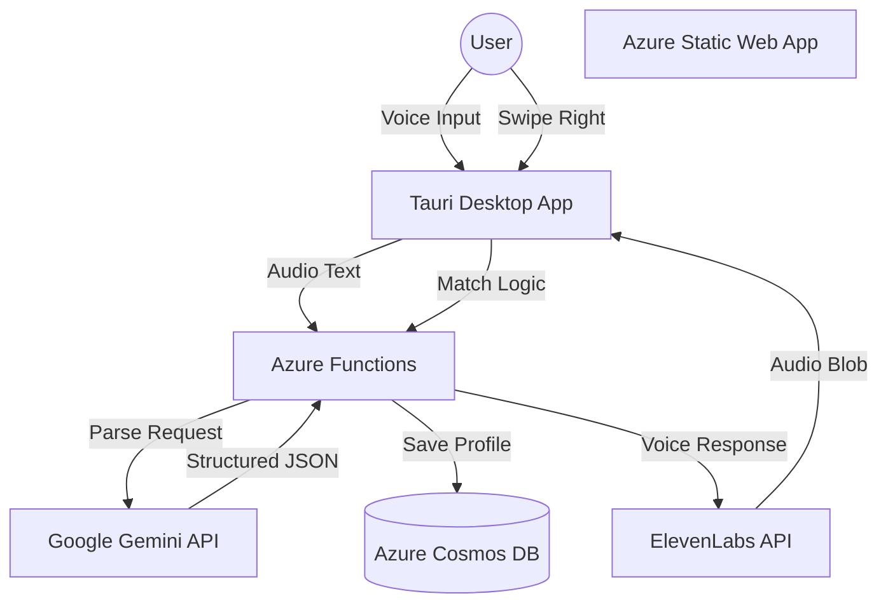

# 🏠 Sublety

> **Tinder for Sublets.** Match by lifestyle, not just price.
> Powered by **Tauri**, **Azure**, **Gemini**, and **ElevenLabs**.


## 💡 The Problem
Finding a sublet—or someone to fill your room—is a nightmare of unformatted Facebook Marketplace posts and sketchy DMs. Most platforms filter by price and location, but ignore the friction points of living with someone: **Lifestyle Compatibility**.

**Sublety** solves this with two innovations:
1.  **Swipe-to-Match:** A familiar interface to find roommates who match your needs (Pets? Smoking? Accessibility?).
2.  **AI Voice Onboarding:** No forms. Just talk to our AI agent, and it builds your profile automatically.

## ✨ Features
* **🗣️ Conversational Onboarding:** Uses **ElevenLabs** for voice generation and **Google Gemini** to parse spoken natural language into structured user profiles.
* **🧩 Smart Filtering:** Automatically filters the "deck" based on non-negotiables (Accessibility, Gender, Vaping/Smoking, Pets).
* **🔥 Tinder-Style UX:** Built with `react-tinder-card` and `canvas-confetti` for a responsive, gamified experience.
* **🖥️ Desktop Native:** Wrapped in **Tauri v2** for a lightweight, native `.exe` experience (using <10% the RAM of Electron).
* **☁️ Serverless:** Fully serverless backend using Azure Functions and Cosmos DB.

## 🛠️ Tech Stack

### Client (Desktop)
* **Framework:** React (Vite) + TypeScript
* **Wrapper:** Tauri v2 (Rust)
* **State:** Zustand (Global State) + SWR (Caching)
* **UI:** Tailwind CSS, `clsx`, `lucide-react`, `react-hot-toast`

### Backend (Serverless)
* **Cloud:** Azure Static Web Apps
* **Compute:** Azure Functions (Node.js)
* **Database:** Azure Cosmos DB (NoSQL)
* **Auth:** Azure Static Web Apps Auth (GitHub/Microsoft)

### AI & Intelligence
* **Google Gemini:** Audio transcript -> JSON Profile Parsing
* **ElevenLabs:** Text-to-Speech User Interaction

### Dev Experience
* **Nix:** Reproducible shell environment
* **SWA CLI:** Local Azure cloud emulation

## 🚀 Getting Started

We use **Nix** to ensure a reproducible development environment. You do not need to install Node.js, Rust, or the Azure CLI globally on your machine.

### 1. Enter the Environment
Navigate to the project root and enter the Nix shell:
```bash
nix-shell

*This will automatically fetch Node.js, Rust/Cargo, Tauri drivers, and the Azure SWA CLI.*

### 2. Install Dependencies
Inside the `nix-shell`:

```bash
npm install
```

### 3. Configure Environment
Create a `.env` file in the `api` folder with your keys:

```env
COSMOS_DB_CONNECTION_STRING=...
GEMINI_API_KEY=...
ELEVENLABS_API_KEY=...
```

### 4. Run Locally
We use `concurrently` to run the Tauri frontend and the Azure backend emulator simultaneously:

```bash
npm run dev
```

* **Frontend:** `http://localhost:5173`
* **Backend API:** `http://localhost:7071`
* **Tauri App:** Will launch in a separate window.

## 🏗️ System Architecture



## 🧠 How the AI Works
We solve the "Form Fatigue" problem using Generative AI.

1.  **Input:** User says *"I have a cat named Luna and I need a wheelchair accessible building."*
2.  **Processing:** **Gemini** analyzes this text against our schema.
3.  **Output:** Gemini returns sanitized JSON:

```json
{
  "has_pets": true,
  "pet_details": "cat",
  "accessibility_needs": ["wheelchair_access", "elevator"]
}
```

4.  **Storage:** This is directly injected into **Cosmos DB**, instantly updating the user's filter preferences.

## Inspiration
As students, the scramble to find housing is a biannual ritual. Whether we are moving for a 4-month co-op term or looking for someone to take over a lease while we study abroad, the current solutions are archaic. We were tired of scrolling through endless, unformatted Facebook Marketplace descriptions and dodging scams.

We wanted to bring the efficiency of modern dating apps to the rental market. We realized that compatibility in housing isn't just about price and location; it's about *lifestyle*. Do you have pets? Do you smoke? Do you need wheelchair accessibility? We built **Sublety** to make finding a place (or a person) as easy as swiping right.

## What it does
**Sublety** is a desktop application connecting sub-letters with renters.

* **Swipe to Match:** Users swipe through cards of potential rentals. A "match" triggers a confetti explosion and opens a chat.
* **Smart Filtering:** The app strictly filters matches based on non-negotiables: Gender preference, Accessibility needs, Smoking/Vaping habits, and Pet ownership.
* **Conversational Onboarding:** Instead of filling out a tedious form, users talk to the app. An AI assistant interviews the user and instantly builds their profile.

## How we built it
We prioritized a modern, lightweight, and reproducible stack.

**The Core Application:**
* **Frontend:** We built the UI with **React** (via Vite) for speed and used **Tauri v2** to wrap it into a lightweight native desktop executable (`.exe`).
* **Swipe Mechanics:** We utilized `react-tinder-card` to handle the physics of the swiping interface.
* **State & Data:** We avoided "prop-drilling" by using **Zustand** for global state management (like tracking the `currentUser`) and **SWR** for efficient data fetching and caching.

**The Serverless Backend (Azure):**
* **Hosting & Auth:** We deployed to **Azure Static Web Apps**, which handled our hosting and provided out-of-the-box authentication via GitHub/Microsoft.
* **API:** Our backend logic runs on **Azure Functions** (Node.js), allowing us to scale endpoints without managing servers.
* **Database:** We used **Azure Cosmos DB** (NoSQL) to store our JSON-heavy user profiles and match data.

**The AI Integration:**
* **ElevenLabs** provides the natural voice for our onboarding assistant.
* **Google Gemini** parses the user's spoken responses into structured JSON for our database.

## Challenges we ran into
* **Local Cloud Emulation:** Running a desktop wrapper (Tauri) alongside a serverless backend locally was complex. We had to use `@azure/static-web-apps-cli` paired with `concurrently` to run the frontend, backend, and emulator in a single terminal command.
* **State Management:** Keeping the "deck" of user cards in sync with the backend while handling rapid swipes was tricky. We used **Zustand** to decouple the UI state from the database logic.
* **Hallucinations vs. Structured Data:** Getting Gemini to output clean, database-ready JSON without "hallucinating" extra fields required significant prompt engineering.

## Accomplishments that we're proud of
* **Reproducible Environment:** We set up a **Nix shell** at the project root. This meant every team member had the exact same dependencies and environment instantly, eliminating "it works on my machine" issues.
* **Polished UX:** We focused heavily on "game feel." Using `canvas-confetti` for matches and `react-hot-toast` for notifications makes the app feel responsive and fun.
* **Serverless Architecture:** We successfully built a full-stack app without provisioning a single server, relying entirely on Azure's serverless ecosystem.

## What we learned
* **Tauri vs. Electron:** We learned how to build cross-platform desktop apps using Tauri, which is significantly more resource-efficient than Electron because it uses the OS's native webview.
* **NoSQL Modeling:** We gained experience structuring data for **Cosmos DB**, optimizing our schema for fast reads (swiping) rather than complex joins.
* **Prompt Engineering is Coding:** We learned that writing natural language prompts for Gemini requires the same rigor and testing as writing standard code.

## What's next for Sublety
* **Mobile Port:** Since we used React and Tauri, porting this to a native mobile app is the next logical step.
* **ID Verification:** Integrating a verification API to prevent scams.
* **Smart Contracts:** Auto-generating sublet agreements based on matched terms.


## 👥 Contributors
* **Taylor Wymes**
* **Pedro Boudoux**
* **Veronica Rodriugez Noguera**
* **Gabriel Crisafi**


