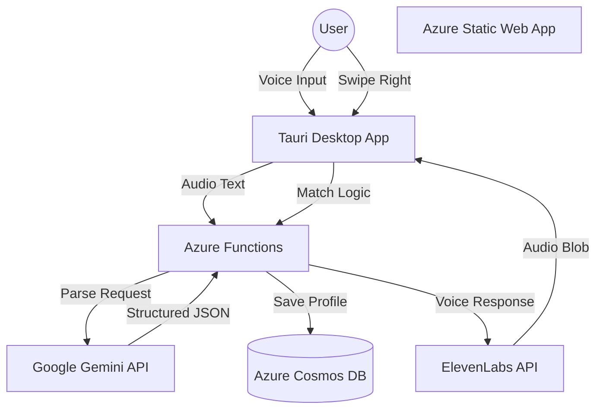

# 🏠 Sublety

> **Tinder for Sublets.** Match by lifestyle, not just price.
> Powered by **Tauri**, **Azure**, **Gemini**, and **ElevenLabs**.


## 💡 The Problem
Finding a sublet, or someone to fill your room, is a nightmare of unformatted Facebook Marketplace posts and sketchy DMs. Most platforms filter by price and location, but ignore the friction points of living with someone: **Lifestyle Compatibility**.

**Sublety** solves this with two innovations:
1.  **Swipe-to-Match:** A familiar interface to find roommates who match your needs (Pets? Smoking? Accessibility?).
2.  **AI Voice Onboarding:** No forms. Just talk to our AI agent, and it builds your profile automatically.

## ✨ Features
* **🗣️ Conversational Onboarding:** Uses **ElevenLabs** for voice generation and **Google Gemini** to parse spoken natural language into structured user profiles.
* **🧩 Smart Filtering:** Automatically filters the "deck" based on non-negotiables (Accessibility, Gender, Vaping/Smoking, Pets).
* **🔥 Tinder-Style UX:** Built with `react-tinder-card` and `canvas-confetti` for a responsive, gamified experience.
* **🖥️ Desktop Native:** Wrapped in **Tauri v2** for a lightweight, native `.exe` experience (using <10% the RAM of Electron).
* **☁️ Serverless:** Fully serverless backend using Azure Functions and Cosmos DB.

## 🛠️ Tech Stack

### Client (Desktop)
* **Framework:** React (Vite) + TypeScript
* **Wrapper:** Tauri v2 (Rust)
* **State:** Zustand (Global State) + SWR (Caching)
* **UI:** Tailwind CSS, `clsx`, `lucide-react`, `react-hot-toast`

### Backend (Serverless)
* **Cloud:** Azure Static Web Apps
* **Compute:** Azure Functions (Node.js)
* **Database:** Azure Cosmos DB (NoSQL)
* **Auth:** Azure Static Web Apps Auth (GitHub/Microsoft)

### AI & Intelligence
* **Google Gemini:** Audio transcript -> JSON Profile Parsing
* **ElevenLabs:** Text-to-Speech User Interaction

### Dev Experience
* **Nix:** Reproducible shell environment
* **SWA CLI:** Local Azure cloud emulation

## 🚀 Getting Started

We use **Nix** to ensure a reproducible development environment. You do not need to install Node.js, Rust, or the Azure CLI globally on your machine.

### 1. Enter the Environment
Navigate to the project root and enter the Nix shell:
```bash
nix-shell

*This will automatically fetch Node.js, Rust/Cargo, Tauri drivers, and the Azure SWA CLI.*

### 2. Install Dependencies
Inside the `nix-shell`:

```bash
bun install
```

### 3. Configure Environment
Create a `.env` file in the `api` folder with your keys:

```env
COSMOS_DB_CONNECTION_STRING=...
GEMINI_API_KEY=...
ELEVENLABS_API_KEY=...
```

### 4. Run Locally
We use `concurrently` to run the Tauri frontend and the Azure backend emulator simultaneously:

```bash
cd backend
bun run build
cd ../frontend
bun tauri dev
```

* **Frontend:** `http://localhost:5173`
* **Backend API:** `http://localhost:7071`
* **Tauri App:** Will launch in a separate window.

## 🏗️ System Architecture



## 🧠 How the AI Works
We solve the "Form Fatigue" problem using Generative AI.

1.  **Input:** User says *"I have a cat named Luna and I need a wheelchair accessible building."*
2.  **Processing:** **Gemini** analyzes this text against our schema.
3.  **Output:** Gemini returns sanitized JSON:

```json
{
  "has_pets": true,
  "pet_details": "cat",
  "accessibility_needs": ["wheelchair_access", "elevator"]
}
```

4.  **Storage:** This is directly injected into **Cosmos DB**, instantly updating the user's filter preferences.

## 👥 Contributors
* **[Pedro Boudoux]** - Full Stack
* **[Veronica Rodriguez Noguera]** - AI Integration
* **[Gabriel Crisafi & Taylor Wymes]** - Design, Assets & Frontend


